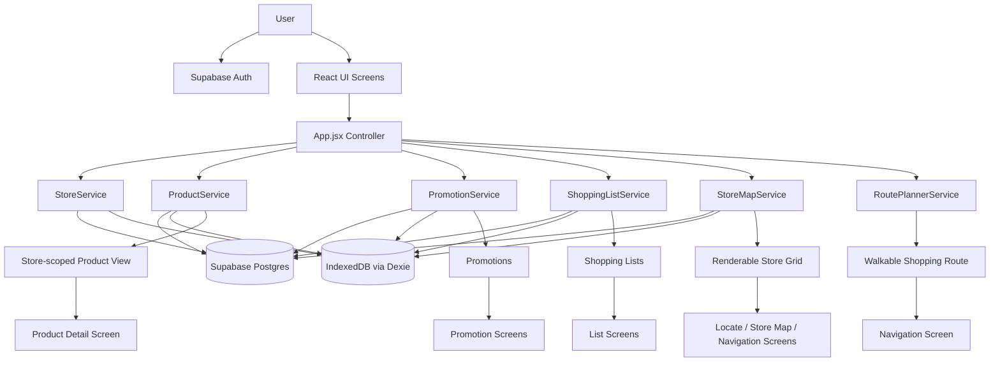
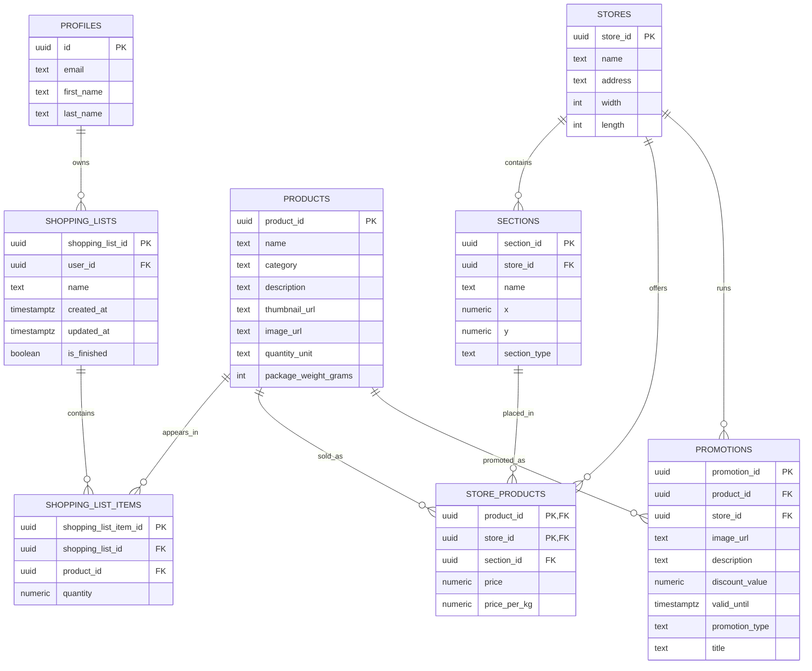

# GroceryLocator

GroceryLocator is a mobile-first grocery shopping assistant built as a React single-page application. It helps a user move through the full in-store workflow in one app: sign in, choose a store, build shopping lists, search the store catalogue, inspect prices and promotions for the selected store, locate a product on the store map, and generate a route from the entrance through the required products to checkout.

The project is not just a list manager and not just a map viewer. Its core idea is that grocery shopping becomes easier when list management, store-specific product data, and physical navigation are connected. The same product can exist in multiple stores with different prices, different promotions, and different locations, so the application is designed around a store-scoped view of the catalogue rather than a generic global product list.

The app is packaged as a Progressive Web App and uses local IndexedDB caching so previously loaded stores, products, promotions, maps, and shopping lists remain accessible when connectivity becomes unstable.

## What the app does

- Authenticates users with Supabase Auth
- Lets the user choose a store before entering the main app flow
- Creates, renames, deletes, and updates shopping lists
- Adds products to lists with quantity support
- Searches products within the currently selected store
- Shows product details, store-specific pricing, and price-per-kilogram information
- Displays current promotions for the selected store
- Locates a product on the store map
- Calculates a route through list items using the store grid
- Tracks collected items during navigation
- Caches loaded data locally for offline read access

## How the app works

At runtime, the app revolves around one active store.

1. The user signs in.
2. The app loads available stores and remembers the selected store per user.
3. Once a store is selected, the app loads:
   - the store map
   - promotions for that store
   - the user's shopping lists
4. Product search is scoped to the selected store, so results only include products offered there.
5. Product details are assembled from:
   - shared product metadata from `products`
   - store-specific price data from `store_products`
   - physical location data derived through `sections`
6. Navigation converts list items into map targets and computes the shortest practical route from entrance to checkout.
7. Loaded data is cached in IndexedDB through Dexie and reused if the network disappears later.

## Current screen structure

The screens are now separated into `src/screens/` and routed from `src/App.jsx`.

- `AuthScreen`
- `StoreSelectionScreen`
- `HomeScreen`
- `AllListsScreen`
- `CreateListScreen`
- `ListSearchScreen`
- `ListDetailScreen`
- `SearchScreen`
- `ProductDetailScreen`
- `LocateScreen`
- `NavigationScreen`
- `PromotionsScreen`
- `PromotionDetailScreen`
- `StoreMapScreen`

`App.jsx` acts as the application controller. It owns:

- session state
- selected store state
- loaded store map
- loaded promotions
- loaded shopping lists
- shared product detail cache
- route wrappers for URL-parameter-driven screens
- navigation helpers

The screen components own local UI state, while the service layer owns data access, normalization, caching, and route computation.

## Architecture

### Frontend architecture

The frontend is a Vite + React application using `HashRouter` for client-side navigation. The current architecture is closer to a service-oriented SPA than to MVVM. There is no Zustand store in the current codebase.

The app is structured into these layers:

- `src/screens/`
  Route-level UI components
- `src/components/`
  Reusable UI pieces such as list rows, search results, store-map rendering, navigation overlays, promotion cards, and the design system
- `src/services/`
  Data access, normalization, map construction, shopping-list persistence, promotions, and route planning
- `src/lib/`
  Shared infrastructure such as the Supabase client and Dexie database
- `src/utils/`
  Formatting, route helpers, and selected-store local storage helpers
- `src/constants.js`
  Shared app constants and route definitions

### Service layer

The service layer is the real backbone of the app.

- `StoreService`
  Loads stores, normalizes dimensions, caches stores locally
- `StoreMapService`
  Loads sections, marks product sections, groups adjacent map cells, builds the renderable grid, and caches complete store maps
- `ProductService`
  Loads products, store-scoped search previews, product detail records, pricing, and section-derived locations; caches both global and store-scoped product snapshots
- `PromotionService`
  Loads store promotions and promotion details; caches them locally
- `ShoppingListService`
  Loads and mutates shopping lists and list items; syncs them with Supabase and Dexie
- `RoutePlannerService`
  Calculates walkable routes on the store grid using BFS and dynamic programming

### UI layer

The UI layer is composed from a small design system and feature components.

- top bar and bottom navigation
- side menu
- search controls
- promotion cards
- list cards and list item rows
- store map renderer
- navigation route overlay

The visual design is implemented with plain CSS rather than a component framework.

## Offline and caching behavior

The app is designed for unreliable mobile connectivity inside a physical store.

Dexie stores the following local data:

- `stores`
- `sections`
- `storeMaps`
- `products`
- `storeProducts`
- `shoppingLists`
- `shoppingListItems`
- `promotions`

What this means in practice:

- shopping lists remain readable offline after they were loaded once
- list items remain readable offline
- promotions remain readable offline
- store maps remain readable offline
- product details remain readable offline
- store-scoped search can return cached products offline for a store that was already loaded

This is offline read support, not a full offline write queue. Mutations still depend on network access unless explicit offline sync logic is added later.

## Backend architecture

The backend is implemented on Supabase and split into a few clear concerns:

- Supabase Auth
  User authentication
- PostgreSQL tables
  Structured application data
- Supabase Storage
  Public image storage for products, thumbnails, and promotions

The schema is designed around a deliberate separation between shared product metadata and store-specific product facts.

### Shared product metadata

Stored in `products`:

- product name
- category
- description
- image URLs
- quantity unit
- package weight

### Store-specific product facts

Stored through `store_products` and `sections`:

- price
- price per kg
- store placement
- section assignment

This is important because the same product can appear in different stores with different prices and different physical locations.

### Media storage

The backend documentation notes that Supabase Storage is used for media with public buckets for:

- `product_images`
- `product_thumbnails`
- `promotion_images`

The app stores media URLs in relational records instead of storing binaries in PostgreSQL.

## Database model

The current schema is built around these tables:

- `stores`
- `sections`
- `profiles`
- `products`
- `shopping_lists`
- `shopping_list_items`
- `store_products`
- `promotions`

### Important relationships

- one `store` has many `sections`
- one `store` has many `store_products`
- one `store` has many `promotions`
- one `product` can appear in many stores through `store_products`
- one `product` can appear in many `shopping_list_items`
- one `shopping_list` has many `shopping_list_items`
- one `profile` owns many `shopping_lists`
- one `promotion` references one product and one store
- one `store_product` points to both a store and the section where that product is placed

## Application diagram



## Database diagram



## Technology stack

### Frontend

- React 19
- React DOM 19
- React Router 7
- Vite 8
- `@vitejs/plugin-react`
- plain CSS

### Backend and data

- Supabase Auth
- Supabase PostgreSQL
- Supabase Storage
- `@supabase/supabase-js`

### Local storage and resilience

- IndexedDB
- Dexie.js

### PWA and deployment

- `vite-plugin-pwa`
- Workbox-generated service worker through the PWA plugin
- GitHub Pages deployment

## Local development

### Prerequisites

- Node.js
- npm

### Environment variables

Create a `.env` file with:

```env
VITE_SUPABASE_URL=your_supabase_url
VITE_SUPABASE_PUBLISHABLE_KEY=your_supabase_publishable_key
```

### Run the app

```bash
npm install
npm run dev
```

### Production build

```bash
npm run build
```

## Notes

- The app currently uses `HashRouter`, which keeps client-side routing simple on GitHub Pages.
